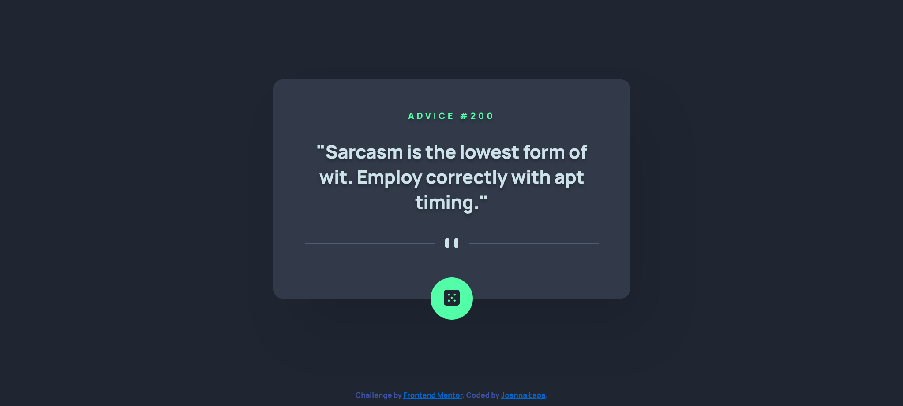

# Frontend Mentor - Advice generator app solution

This is a solution to the [Advice generator app challenge on Frontend Mentor](https://www.frontendmentor.io/challenges/advice-generator-app-QdUG-13db). Frontend Mentor challenges help you improve your coding skills by building realistic projects.

## Table of contents

- [Overview](#overview)
  - [The challenge](#the-challenge)
  - [Screenshot](#screenshot)
  - [Links](#links)
- [My process](#my-process)
  - [Built with](#built-with)
  - [What I learned](#what-i-learned)
  - [Continued development](#continued-development)
  - [Useful resources](#useful-resources)
- [Author](#author)

## Overview

### The challenge

Users should be able to:

    View the optimal layout for the app depending on their device's screen size
    See hover states for all interactive elements on the page
    Generate a new piece of advice by clicking the dice icon

### Screenshot

### Links

- Solution URL: [Add solution URL here](https://github.com/JoannaLapa/advice-app-challenge)
- Live Site URL: [Add live site URL here](https://joannalapa.github.io/advice-app-challenge/)

## My process

### Built with

- Semantic HTML5 markup
- CSS custom properties
- Flexbox
- Mobile-first workflow
- Gulp

### What I learned

During this project I learnt how to use fetch and resolve problem with default using data by cache. I practised flexbox skills. 

### Continued development

I focus now on developing practice skills in Javascript. My future planns are to learn React or Vue framework.

### Useful resources

https://developer.mozilla.org/en-US/docs/Web/CSS/filter-function/drop-shadow
https://developer.mozilla.org/en-US/docs/Web/API/Request/cache - article about cache, which helped me how to resolve the problem with default using the cache. Setting 'no-cache' makes that ' the browser makes a conditional request to the remote server. If the server indicates that the resource has not changed, it will be returned from the cache. Otherwise the resource will be downloaded from the server and the cache will be updated.

## Author

- Frontend Mentor - [@JoannaLapa](https://www.frontendmentor.io/profile/yourusername)
- Github - [@JoannaLapa](https://github.com/JoannaLapa)

